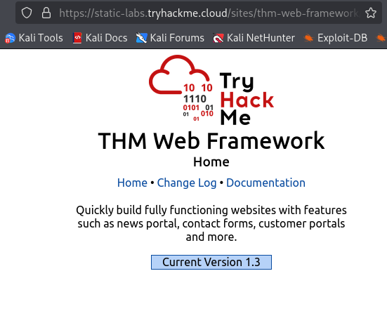
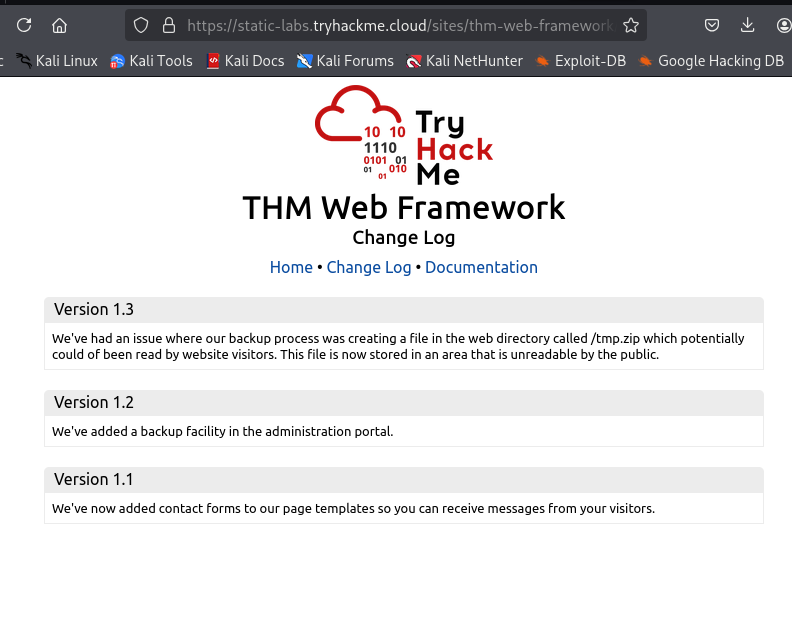
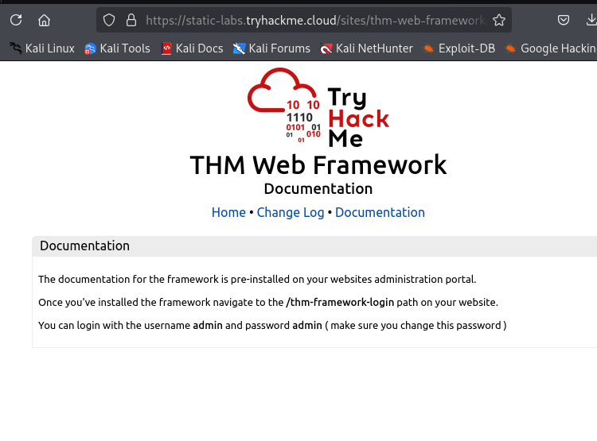
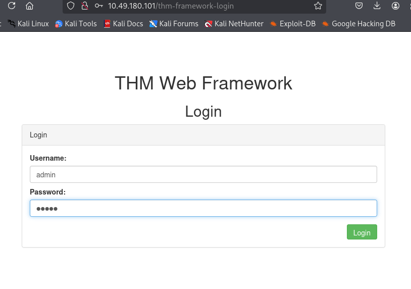
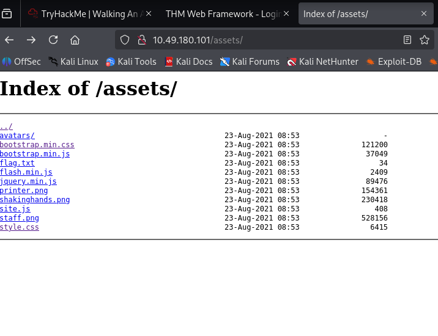

# Walking An Application

## 📌 Summary
In this room the main focus is to manually find the clues and hints in the website to find juciy information about the site using view page source tool available in browser

**What I Learned**

- Developer comments in the source code may leak sensitive information or -provide hints for further enumeration.

- Manually browsing through different sections of a website can reveal -hidden files, directories, and misconfigurations.

## 🛠️ Techniques / Tools
- **View Page Source**  
The main technique in this room is manually inspecting the page source using built-in browser tools.

## Website structure
| Feature | URL |
|------   |-------------|
| Home Page|/|
| News | /news|
|News Article|/news/article?id=1|
|Contact|/contact|
| Customers |/customers|
|Customer Login|/customers/login|
| Customer Signup|	/customers/signup|
| Customer Reset Password| /customers/reset|
|News Article|/news/article?id=1|
| Customer Dashboard|/customers|
| Create Ticket | /customers/ticket/new|
|Customer Account|/customers/account|
|Customer Logout|/customers/logout|

# LAB Walkthrough

## Initial Page View

**Findings**

While inspecting the page source, I found a hidden link pointing to:
[`/secret-page`]  

Visiting this page reveals the flag:
[`THM{NOT_A_SECRET_ANYMORE}`]

[! Note ]
- at the end of home page souce code you will find a link to static thm framwork site

`https://static-labs.tryhackme.cloud/sites/thm-web-framework )
-->`

## THM-Web-Framework Site

**Findings**

While exploring this site, I found two major hints:

1. In **Chaange Log** page : 
Here `/tmp.zip directory` is mention

- Downloading and extracting this file provides **flag.txt**, which contains another flag.

2. In **Documentation** : 
The documentation mentions:
[`/thm-framework-login`]

Along with credentials:

- Username: admin
- Password: admin  

Logging in using these credentials gives another flag.

## Directory Searching 
For the last flag it takes me a much more time than others flags
for this i search through the source code of different directory of the site
but could not find any clue 

**Findings**
While checking linked files, I clicked on a `style.css` reference and noticed it was located inside an `assets` directory.
when Navigating to:this directory i see multiple static files 

Inside this directory, there is a file named **flag.txt**

## Opening it reveals the final flag.

🎉 **End of Lab**

All flags collected successfully.

