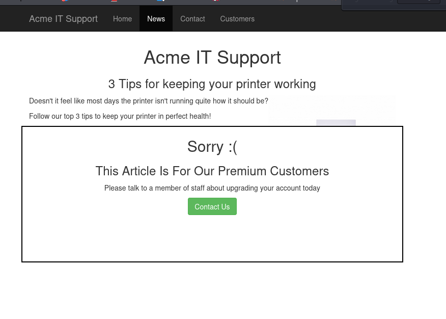
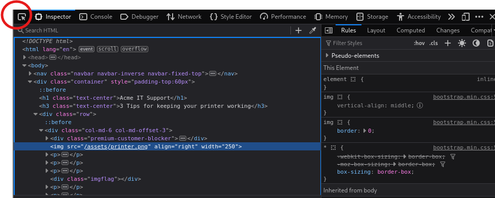

# Walking An Application

## 📌 Summary
In this room the main focus is to manually find the clues and hints in the website to find juciy information about the site using view page source tool available in browser

**What I Learned**

- Developer comments in the source code may leak sensitive information or -provide hints for further enumeration.

- Manually browsing through different sections of a website can reveal -hidden files, directories, and misconfigurations.

## 🛠️ Techniques / Tools
- **View Page Source**  
- **Inspector**
- **Debugger**
- **Network**

## Website structure
| Feature | URL |
|------   |-------------|
| Home Page|/|
| News | /news|
|News Article|/news/article?id=1|
|Contact|/contact|
| Customers |/customers|
|Customer Login|/customers/login|
| Customer Signup|	/customers/signup|
| Customer Reset Password| /customers/reset|
|News Article|/news/article?id=1|
| Customer Dashboard|/customers|
| Create Ticket | /customers/ticket/new|
|Customer Account|/customers/account|
|Customer Logout|/customers/logout|

# LAB Walkthrough TASK 3
## [Viewing The Page Source]

## Initial Page View

**Findings**

While inspecting the page source, I found a hidden link pointing to:
[`/secret-page`]  

Visiting this page reveals the flag:
[`THM{}`]

[! Note ]
- at the end of home page souce code you will find a link to static thm framwork site

`https://static-labs.tryhackme.cloud/sites/thm-web-framework )
-->`

## THM-Web-Framework Site

**Findings**

While exploring this site, I found two major hints:

1. In **Chaange Log** page : 
Here `/tmp.zip directory` is mention

- Downloading and extracting this file provides **flag.txt**, which contains another flag.

2. In **Documentation** : 
The documentation mentions:
[`/thm-framework-login`]

Along with credentials:

- Username: admin
- Password: admin  

Logging in using these credentials gives another flag.

## Directory Searching 
For the last flag it takes me a much more time than others flags
for this i search through the source code of different directory of the site
but could not find any clue 

**Findings**
While checking linked files, I clicked on a `style.css` reference and noticed it was located inside an `assets` directory.
when Navigating to:this directory i see multiple static files 

Inside this directory, there is a file named **flag.txt**

Opening it reveals the final flag   

# LAB Walkthrough TASK 4
## [Developer Tools - Inspector]

- Tool used: [Inspector]

The first two articles are readable, but the third has been blocked with a floating notice above the content stating you have to be a premium customer to view the article.

If you come from a computer science or development background, you might already know that we often use browser developer tools to analyze, inspect, and modify elements of a web page live — without needing to open a code editor.

When you hover over the notice block using the browser inspector (the hover/select arrow tool)

You’ll see that it’s a 
 element whose CSS display property is set to block.
If you change that property to:

`display: none;`

the notice block becomes hidden — and the flag underneath it becomes visible.

  

# LAB Walkthrough TASK 5
## [Developer Tools - Debugger]

The Debugger is a built-in browser tool (in Chrome, Firefox, Edge) that lets you:

- View JavaScript files

- Pause JavaScript execution

- Set breakpoints

- Inspect values of variables

- Modify values live

- See network calls triggered by JS

- Understand how the website logic works

## Flash Message Analysis (Using the Debugger Tool)

The lab instructions mention that when you click on the Contact page, you may briefly notice a red flash on the screen.  
Initially, I didn’t notice this behavior while solving earlier tasks, but after reading the hint, I paid attention — and yes, a quick red flash does appear every time the page loads.

To understand why this happens, we need to inspect the JavaScript running behind the page.

📂 Inspecting the JavaScript (**flash.min.js**)

When you open the Debugger in your browser, you’ll see a file named:
`
flash.min.js`

If you're not from a coding background, the minified JavaScript code might look confusing — but the core idea is simple:

✔️ What this script does:

It creates a `
` containing a message

It displays the div for a very short time

Then it removes the div after 5 milliseconds using a setTimeout() function

This is why the red flash appears too quickly to read — the script removes the element almost instantly.

### 🔥 Stopping the Flash From Disappearing (Using Breakpoints)

To freeze this flash message on the screen, we need to pause JavaScript execution right before the div is removed.

✔️ Steps:

- Open Developer Tools → Sources (Debugger)

- Open the file flash.min.js

- Find the line where the script calls something like:

- element.remove(); or parent.removeChild(div);

Click the line number to set a breakpoint.

This tells the browser to pause execution exactly when the script tries to remove the flash message.

🔁 Reloading the Page to Trigger the Breakpoint

Once the breakpoint is set:

- Refresh the Contact page

- The JavaScript will run until it hits the breakpoint

- The page will freeze at the exact moment before the div is removed

The red flash message will now stay visible

You can inspect the div and its contents (often containing a flag or hint)

# LAB Walkthrough TASK 6
## [Developer Tools - Debugger]

📡 Observing the Contact Form Request (Network Tab)

The Network Tool in your browser shows every request your browser sends to a website and every response the server sends back.

It is like a real-time traffic monitor between your browser and the internet.

The lab instructs us to send a message through the Contact page and analyze how the server responds.
To do this properly:

- Fill out the Contact form

- Open Developer Tools → Network tab

- Submit the form

Watch the new request that appears in the Network panel

🔍 What We Observe

After submitting the form, you’ll see a POST request in the Network tab named something like:

`contact-msg`

This is the request the browser sends to the server when the contact form is submitted.

📥 Checking the Server Response

- Click on the contact-msg request and open the:

- Headers tab (to see form data sent)

- Response tab (to see what the server returns)

- Inside the Response tab, you will find the final flag for this lab.

This flag is not shown on the visible web page — it only appears in the server’s raw response, which is why checking the Network panel is essential.

